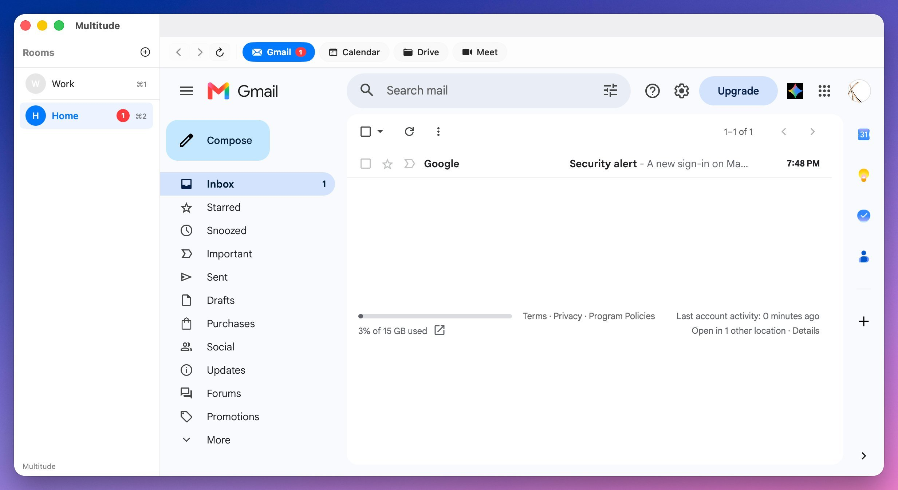

# Multitude

A macOS desktop app that lets you run multiple Google accounts side-by-side — each in its own fully isolated browser session. Switch between Gmail, Calendar, Drive, and Meet with a click.



## Features

- **Multi‑account rooms** — Sign into a different Google account in each room. Cookies, localStorage, and IndexedDB never leak between them.
- **Service tabs** — Pill‑shaped tabs for Gmail, Calendar, Drive, and Meet. The active tab loads automatically when you switch rooms.
- **Gmail unread badges** — Unread counts appear on the Gmail pill and in the sidebar (powered by Gmail's RSS feed).
- **Navigation controls** — Back, forward, and reload buttons in the toolbar.
- **Room keyboard shortcuts** — `⌘1`–`⌘9` to jump between rooms.
- **Persistent sessions** — Login state survives app restarts via per‑account `WKWebsiteDataStore`.
- **Debug panel** — `⌘⌥D` toggles a live log of navigation events, cookie extraction, and unread checks.
- **Camera & microphone** — Properly configured for Google Meet calls (requires the `.app` bundle).

## Requirements

- macOS 14.0 (Sonoma) or later
- Xcode Command Line Tools (`xcode-select --install`)
- No full Xcode required

## Installation

Quick install (builds release, wraps in `.app`, launches):

```bash
./install.command
```

Build debug and install:

```bash
./install.command --debug
```

Or use the Makefile:

```bash
make clean   # Remove build artifacts
make build   # Compile the binary
make run     # Package into Multitude.app and open
```

The `.app` bundle is required for camera and microphone permissions — macOS reads `Info.plist` from bundles only.

## Usage

### Rooms

- **Add a room** — Click the `+` button in the sidebar or use `⌘⇧N`. Give it a name and optional email label.
- **Switch rooms** — Click a room in the sidebar or press `⌘1`–`⌘9`.
- **Rename / Reset / Delete** — Right‑click a room for the context menu.

### Service tabs

The toolbar shows four pill‑shaped tabs:

| Pill       | URL                          |
|------------|------------------------------|
| Gmail      | mail.google.com              |
| Calendar   | calendar.google.com           |
| Drive      | drive.google.com              |
| Meet       | meet.google.com               |

Clicking a pill navigates the current room's web view. The active tab is highlighted and auto‑selects when you switch rooms.

### Navigation

- **Back** — `⌘[` or toolbar left arrow
- **Forward** — `⌘]` or toolbar right arrow
- **Reload** — `⌘R` or toolbar refresh

### Debug panel

Toggle with `⌘⌥D`. Shows a chronological log of navigation events, unread badge fetches, and cookie extraction for troubleshooting.

## Permissions

Multitude requests two system permissions for Google Meet:

- **Camera** (`NSCameraUsageDescription`)
- **Microphone** (`NSMicrophoneUsageDescription`)

macOS prompts for these the first time Meet tries to access them. You must launch the `.app` bundle (not the raw binary) for the prompts to appear.

## Logging

File‑based rolling logger writes to `~/Library/Logs/Multitude/`:

```
~/Library/Logs/Multitude/
├── multitude-2026-07-08.log
├── multitude-2026-07-07.log
└── ...
```

- Daily rotation
- Auto‑cleanup after 7 days
- Levels: DEBUG, INFO, WARN, ERROR

Tail live:

```bash
tail -f ~/Library/Logs/Multitude/multitude-$(date +%F).log
```

